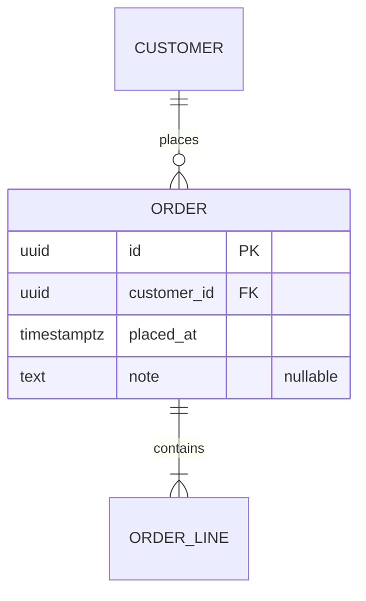

# ERD Standard

## About This Standard

An entity relationship diagram has one de jure standard and one de facto standard, and they are not the same thing.

The de jure standard is IDEF1X. It was published as FIPS PUB 184 by the Computer Systems Laboratory of NIST on 21 December 1993, and adopted internationally as ISO/IEC/IEEE 31320-2:2012, which defines the syntax and semantics of IDEF1X97. It was reviewed in 2024 and confirmed, so it remains current. It is also the only entity relationship notation any standards body has ever published, and in thirty years it has had no revision and almost no adoption outside United States federal work.

The de facto standard is crow's foot. Gordon Everest introduced it in 1976 in "Basic Data Structure Models Explained with a Common Example", presented at the Fifth Texas Conference on Computing Systems, where he called it the inverted arrow because, unlike Bachman's notation, it implied no direction and no physical access path. Others named it crow's foot later. It was carried into Information Engineering, and it is now what every modelling tool draws by default.

Chen's notation, from the same year, is the one taught in universities and used almost nowhere else, because a diagram that gives every attribute its own ellipse does not fit a real schema on a page. Barker's notation, from CACI around 1981, is crow's foot with a different treatment of optionality and survives mainly in Oracle documentation.

UML class diagrams are a genuine standard, ISO/IEC 19505-1 and 19505-2:2012, confirmed in 2025, with the current specification being OMG UML 2.5.1. But they describe an object model, not a relational one, and using them for a schema means borrowing a notation and then agreeing privately how to read it.

This document takes the de facto standard. The notation is crow's foot, written in Mermaid, because Mermaid is text, and text is the only form of a diagram that survives review, merges, and version control. Where a UML class diagram is wanted for other reasons, that is a separate artefact and does not replace this one.

An entity relationship diagram is not a document. It is an artefact that lives inside one, and the rules below say which one.

Everything here assumes a relational database. Section 9 says what to do when the store is not one.

## 1. Levels

Three levels exist and they are not interchangeable. Drawing the wrong one for the audience is the most common failure.

The conceptual model records entities, their relationships, and nothing else. No attributes, no keys, no types. It answers what things exist and how they relate, and it is the only level a non-technical reader should be shown. It belongs in the high level design, under crosscutting concepts, and only where data ownership is an architectural question. If the system has one database and no ownership to settle, it is not drawn at all.

The logical model adds attributes, primary keys, and foreign keys, and resolves every many-to-many relationship. It is still independent of any database product. It belongs in the low level design as the first half of the information viewpoint.

The physical model is the logical model written out against one named database product and version, with that product's types, its constraints, and its indexes. It belongs in the low level design as the second half of the information viewpoint. A physical model that does not name its product and version is not a physical model.

## 2. Notation

Crow's foot, in Mermaid `erDiagram` syntax.

Each relationship carries two cardinality markers, one at each end. The outer character is the maximum and the inner character is the minimum.

| Left | Right | Meaning |
|------|-------|---------|
| `\|o` | `o\|` | Zero or one |
| `\|\|` | `\|\|` | Exactly one |
| `}o` | `o{` | Zero or more |
| `}\|` | `\|{` | One or more |

The line style carries existence. A solid line, written `--`, is an identifying relationship: the child cannot exist without the parent, and the parent's key forms part of the child's. A dashed line, written `..`, is non-identifying: the child stands on its own. Both are always stated, because a diagram where every line is solid has recorded nothing.

Attributes are written inside braces as `type name`, with `PK`, `FK`, or `UK` after the name, several separated by commas, and an optional comment in double quotes. A type ending in `?` is optional.

## 3. Entities

One entity is one thing the business can name. If the name needs a conjunction, it is two entities.

Names are singular and in upper case, because a table holding many rows still describes one kind of thing, and the plural form starts arguments that have no answer. The same name is used in the diagram, in the schema, and in the code. Where the business word and the technical word differ, the business word wins and the difference is recorded in the glossary.

An entity with no attributes other than its own key and a foreign key is a join table, not an entity, and it is drawn only in the logical and physical models.

## 4. Attributes

Attributes appear at the logical level and below, never in the conceptual model.

Every entity has exactly one primary key. Composite keys are written as several attributes each marked `PK`. Every foreign key is marked `FK` and matches a relationship drawn on the diagram; a foreign key with no line is an error in the diagram, not a shortcut.

Uniqueness that the business relies on is marked `UK`, because a constraint that exists only in the database and not in the diagram will be dropped by someone who never knew it mattered.

Types are written at the logical level in general terms and at the physical level in the exact spelling of the named product. `string` is a logical type. `varchar(255)` is a physical one, and it belongs only in the physical model.

## 5. Relationships

Every relationship carries a label, and the label is a verb read from the left entity to the right one. Mermaid renders only that one direction, so the label is chosen to read correctly in it.

Many-to-many relationships are resolved before the logical model is finished. The join entity is given a name of its own from the business vocabulary, not a concatenation of the two entities it joins, and any attribute the relationship carries lives there.

Optionality is recorded on both ends and is the part most often left wrong. Zero or one and exactly one are different statements about the world, and the difference decides whether a column is nullable.

Where a relationship exists only under a condition the diagram cannot express, the condition is written next to the diagram in prose. It is not left to be discovered in code.

## 6. Physical Schema

The physical model is written out as data definition language for the named product, not only as a diagram. The diagram shows the shape; the statements show the truth. Where the two disagree, the statements are correct and the diagram is fixed.

Indexes are recorded here with the queries that justify them. An index with no named query is either unnecessary or undocumented, and both are worth finding out.

Constraints, defaults, cascade rules, and collation belong here and nowhere above.

## 7. Traceability

Each diagram records which building block from the high level design owns the data it describes, and which requirement identifiers the entities ultimately serve. Read downward this explains why an entity exists. Read upward it shows whether any requirement has been left with nowhere to store its data.

Where two building blocks own parts of one diagram, the ownership boundary is drawn on it, because a schema shared between services without a recorded boundary becomes a shared database by accident.

## 8. Out of Bounds

Physical types, indexes, and constraints do not appear in the conceptual model. Attributes do not appear in it either.

Attributes that exist only for a framework, such as a row version or a soft delete flag, are recorded in the physical model and left out of the logical one, because they answer a question about the tooling rather than about the business.

The diagram is not the schema. It is a view of it. Anything that cannot be read from the diagram in a few seconds is better written as a sentence beneath it than crammed into the drawing.

## 9. Non-Relational Stores

Sections 1 through 8 hold only for a relational database: PostgreSQL, MySQL, MariaDB, SQL Server, Oracle, SQLite, DB2. They rest on primary keys, foreign keys, and normalisation, and none of those exist outside the relational model. Applied to a document store or a key-value store they produce a model that is not merely awkward but wrong, because they force a shape the engine was built to avoid.

There is no replacement to point to. The relational model could be standardised because it has one, Codd's, built on set theory, which is why SQL became an ANSI standard in 1986 and an ISO standard in 1987 and is still maintained as ISO/IEC 9075. The non-relational engines share no such model. Each was built to solve a different problem, and there is nothing common between them to standardise. Graph is the single exception: ISO/IEC 39075:2024 defines GQL for property graphs, published in April 2024, the first database language standard ISO has issued since SQL.

So the rule for a non-relational store is the same rule the low level design already follows. There is no outline to fill in. Decide what has to be recorded for the store actually chosen, record it, and say why those things and not others.

What that means in practice, per family:

A document store is modelled from access patterns rather than from normal forms. Entities still exist, but the decision on each relationship is whether to embed or to reference, and that decision follows the read path and the document size limit, not the shape of the data. Record it per relationship with the reason. Crow's foot has no symbol for embedding, so where a diagram is drawn at all it shows references only, and the embedded structure is written out as an example document beside it.

A key-value store has no entities to draw. What is recorded is the key pattern, the value type, the expiry, and the eviction behaviour: `session:{user_id}` as a hash, fields listed, TTL 1800 seconds. A diagram adds nothing. A table does.

A wide-column store is modelled backwards from the queries. One entity commonly becomes several tables, one per access path, each denormalised, and the duplication is deliberate. Record the query first and the table it justifies second, because a reviewer who sees the tables alone will try to normalise them.

A graph store uses the property graph model, with nodes, relationships, labels, and properties, and GQL where the engine supports it. Record node labels with their properties, relationship types with direction and properties, and the traversals the model is meant to serve.

Whichever family it is, section 7 still applies without change. The building block that owns the data and the requirement identifiers it serves are recorded the same way, because traceability does not depend on the storage engine.